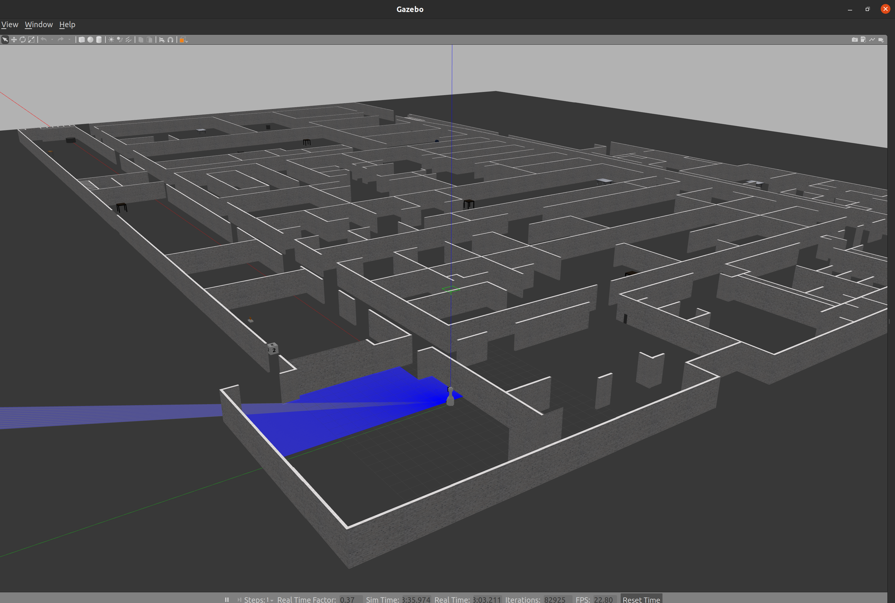
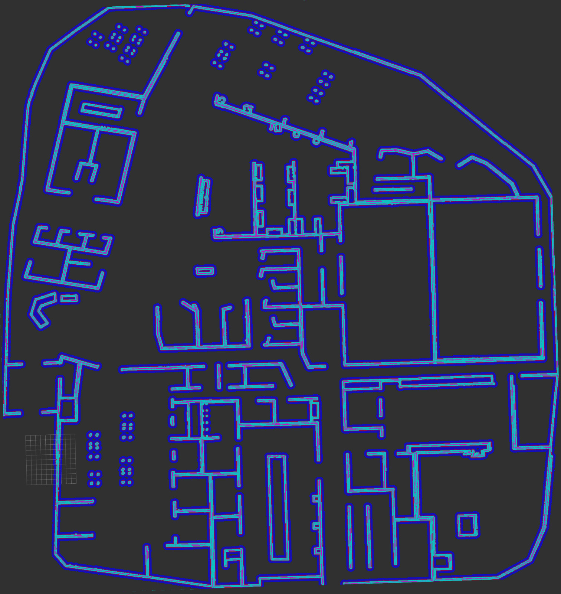

# Sentrybot_ws
This repository stores all the codes and information about the Sentrybot project that was developed in Summer 2021. 
------------------------------------------------------------------------------------------------------------------
This project is about a welcoming robot called Sentrybot that can navigate autonomously to take anyone approaching for direction to a commonly visited place in Bergeron building. Apart from using ROS and Slam_toolbox it uses Speech Recognition Pocketsphinx to spot the keywords from the visitors for navigation.
------------------------------------------------------------------------------------------------------------------
**Instructions on How to Use the Code:**

Publishing a picture on the monitor:
  - Simply change the name of the file under the image_publisher node in sentrybot_gazebo.launch launch file or other gazebo launch files that you would like to launch.
  - You can comment the node if you don't want the picture to be seen on the monitor at the start of the launch file.
--------------------------------------------------------------------------------------------------------------------------------------
Working with the camera:
  - you can type in the following command to see the camera view of the robot or to see any object that's being placed in front of the camera. rosrun image_view image_view image:=/sentrybot/camera/image_raw
--------------------------------------------------------------------------------------------------------------------------------------
Streaming a video on the monitor:
  - Videos can be streamed on the screen of the monitor by changing the value of the argument "video_stream_provider" by the exact location of the video.
--------------------------------------------------------------------------------------------------------------------------------------
Mapping Sherman and Bergeron buildings:
  - Sherman and Bergeron worlds or any other place (Gazebo or real life structures) can be mapped using the online_sync.launch located in sentrybot_description/slam_toolbox-noetic-devel/slam_toolbox/launch file with the mapping mode that can be modified in the related config file in sentrybot_description/slam_toolbox-noetic-devel/slam_toolbox/config. To save a mapped structure using rviz, go to panels/add_new_panel and choose SlamToolboxPlugin. Once the GUI is opened you can give it a name and click the Save Map button. However, ready-made maps are available for both buildings using the following Google Drive links:
    - Sherman building: https://drive.google.com/file/d/1GQlb0vqm0hGnr7P2gEVsY-TgTIJ1EQ0L/view?usp=sharing
    - Bergeron building: https://drive.google.com/file/d/1inqQ13eGKwfEpdesvCqHVc5P3-L_DDy8/view?usp=sharing
  - To load your mapped pose-graph, modify the name of the map_file_name located in sentrybot_description/slam_toolbox-noetic-devel/slam_toolbox/config/mapper_params_online_sync.yaml and provide any starting pose if applicable.
  - For localization please use the online_sync.launch file by changing its mode to localization from mapping in the related config files form mapping.
<<<<<<< HEAD
--------------------------------------------------------------------------------------------------------------------------------------
*** Note: Further instructions about the usage of slam_toolbox package is available in the readme file of its package. ***
=======
--------------------------------------------------------------------------------------------------------------------------------------

Working with Audio Classification:
  - Audio_source node captures audio that is saved forever in ROS
  - Audio_classification takes this audio from the log and temporarily creates an audio
  - This audio file is the used to calculate audio classification
  - The file functions.py is required for it to run
  - The folders Audio_only and Audio_Text contain the models trained to work for audio classification and are required
  - The files helper.py, features.py and graph_formatting.py are also required for the functions defined in functions.py
  - To calculate features, start the audio_source node, and then run the audio_classification node. The results can be seen via ```rostopic echo /sentrybot/sentimentanalysis``` command
  - The results are posted via a custom ROS msg calledn SentimentAnalysis.msg
--------------------------------------------------------------------------------------------------------------------------------------
Some Screenshots of the work can be found on this link:
  - https://drive.google.com/drive/folders/1ZVcDkdwSghNCSYnVnfP8n7O6LT7Tvtxa?usp=sharing
--------------------------------------------------------------------------------------------------------------------------------------
Sequence of launching all the neccessary files:
  1. Launching the Gazebo simulator: roslaunch sentrybot_gazebo sentrybot_sherman.launch
  2. Launching the rviz sumulator: roslaunch sentrybot_description sentrybot_rviz.launch 
  3. Controlling the robot using keyboard: rosrun teleop_twist_keyboard teleop_twist_keyboard.py cmd_vel:=/sentrybot/cmd_vel
  4. Launching the slam_toolbox maping file (For mapping & navigaiton): roslaunch slam_toolbox online_sync.launch 
  5. Launching the language provided the exact path and lunching the speech recognizer (pocketsphinx): oslaunch pocketsphinx kws.launch dict:=/home/ubuntu/catkin_ws/src/pocketsphinx/demo/voice_cmd.dic kws:=/home/ubuntu/catkin_ws/src/pocketsphinx/demo/voice_cmd.kwlist hmm:=/home/ubuntu/catkin_ws/src/pocketsphinx/demo/cmusphinx-en-us-8khz-5.2
  6. Launching the Python script to get the speech and navigate to the goal based on the speech: rosrun autonomous_nav set_goal_custom.py 
--------------------------------------------------------------------------------------------------------------------------------------
The navigation and speech_recognition were developed and implemented by Adnan Fahad Faizi, a Computer Science student at Lassonde School of Engineering in LURA summer program under the supervision of Prof. Michael Jenkin.
--------------------------------------------------------------------------------------------------------------------------------------
Here are some screenshots and videos of the work:

  ***Sherman Building 3D Gazebo Simulator***
  
  
 
  
  ***Costmap Bergeron Building RVIZ Simulator***
  
  
  


--------------------------------------------------------------------------------------------------------------------------------------
**Abstract:**
  For an autonomous agent to be able to perform tasks in a given environment it must be able to navigate safely and accurately in a known or unknown environment by avoiding obstacles and reaching a given goal. The Sentrybot robot utilizes the Robot Operating System (ROS) as a middleware to provide robot control. Sentrybot can be controlled via keyboard or joystick teleoperation, but for autonomous navigation, it requires four components: a map of the environment, its current location concerning the map (the robot’s pose), and a route to take that avoids obstacles. My work uses, an open-source ROS package that uses laser scan data coming from the LIDAR attached to the robot and the transformation of the odometry and map frames, to map the environment. For localization, Adaptive Monte Carlo Localization (AMCL) is used to estimate the robot's pose. Given a map and the robot’s location, the robot can use the specific destination goals and safely follow a path to the given goals on the map. During travel, the robot can avoids any dynamic objects and creates alternative paths for reaching the goal. All testing to date has used the Gazebo simulator and we are using a model of the ground floor of the Bergeron centre with identified destinations for the robot to help guide visitors seeking help while securing the space. We are aiming to be able to test the robot in a real-world environment later this summer.
  
Link to official LURA 2021 Page: https://lassonde.yorku.ca/research/undergraduate-research-at-lassonde/2021-lura-and-usra-research-at-lassonde
Link to the presentaion of Sentrybot for 2021 Undergraduate Summer Student Research Conference: https://www.youtube.com/watch?v=taCb_kH51BE&t=3s
--------------------------------------------------------------------------------------------------------------------------------------

By Faizi, Adnan Fahad

